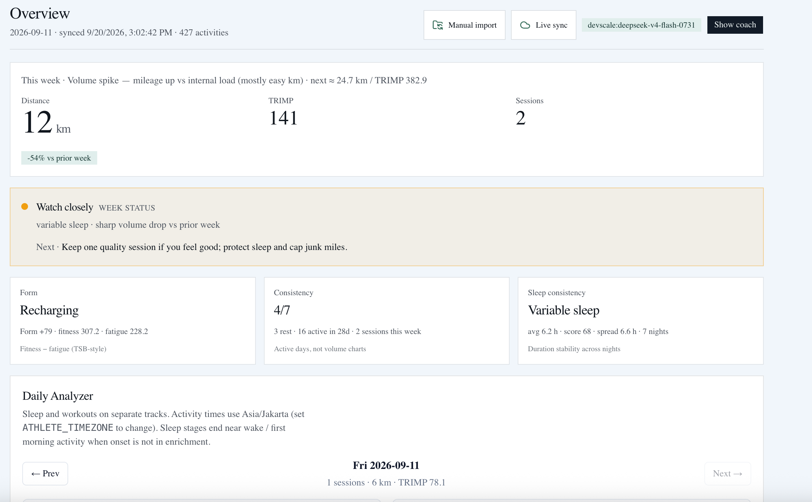
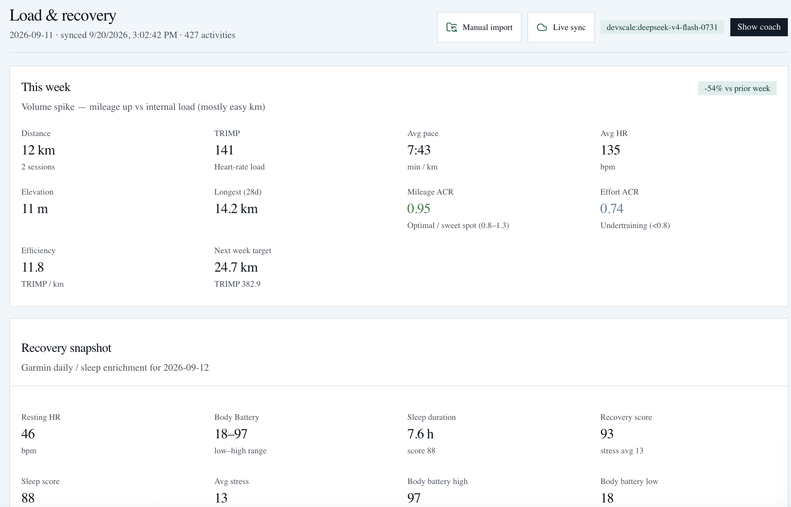
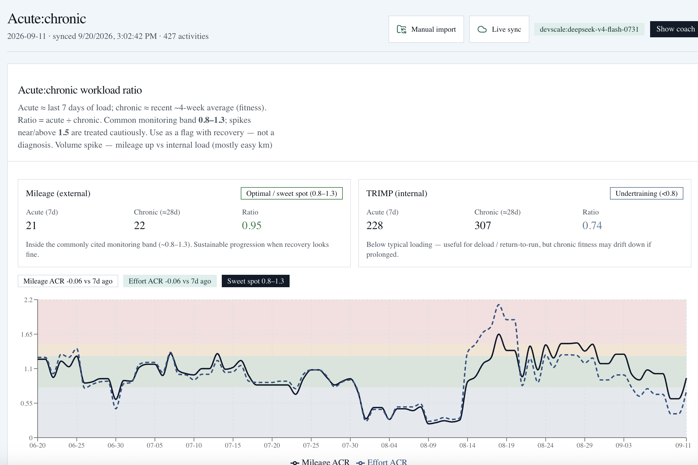

# StrideLab

[](LICENSE)


Open-source personal endurance coaching lab powered by Anvia agents and tools.

Import your Garmin history, assess readiness and training load, build calendar-based
training plans for your next goal, and chat with a coach that grounds every answer
in your own data. A complete MCP toolset lets any MCP-capable client (Cursor,
Claude, VS Code, Windsurf, …) reuse the same coach tools.

> **New here?** Start at [Setup](#setup) — you only need `pnpm install`,
> a `.env` file (see [`.env.example`](.env.example)), and `pnpm lab:dev`.

## Features

1. Importing data via Garmin (`garTools`)
2. Analyze training readiness (`readyTools`)
3. Analyze training load and projected future (`fitTools`)
4. Build training on a calendar basis from your target (`coachPersonalTools`)
   - Ultra Marathon focus
   - Ultra Trail focus
   - Running focus (42K, 21K, 10K, 5K)
   - Triathlon focus (IM, Half IM, tri distance)
5. Export data weekly (`exportTools`)
   - Social media — compact stats
   - Details — HTML report
6. Coach chat + MCP server sharing one tool contract (`apps/lab`)

## Screenshots







## Prerequisites

- Node.js 20+ (22 recommended)
- [pnpm](https://pnpm.io/) 11+
- Python 3.10+ (only for the optional live Garmin connector)
- A Garmin Connect export (`DI_CONNECT`) for manual import, and/or a Garmin
  Connect account for live sync

## Setup

From the repository root:

```bash
pnpm install
```

Create a `.env` file at the project root (see `.env.example`):

```env
LLM_PROVIDER=devscale

# Devscale AI gateway — https://gateway.devscale.id/console/documentation
DEVSCALE_BASE_URL=https://gateway.devscale.id/v1
DEVSCALE_API_KEY=your_devscale_key
DEVSCALE_MODEL=gpt-4.1

# Direct OpenAI — used when LLM_PROVIDER=openai
OPENAI_BASE_URL=https://api.openai.com/v1
OPENAI_API_KEY=your_openai_api_key
OPENAI_MODEL=gpt-4.1

TAVILY_API_KEY=your_tavily_api_key
GARMIN_EXPORT_DIR=/path/to/DI_CONNECT
GARMIN_LIVE_ENABLED=false
```

Set `LLM_PROVIDER=devscale` (default) or `openai`. Keep both key sets in `.env` and switch with that one variable.

## Run (Anvia Studio)

Start the local agent + Studio UI from the repo root:

```bash
pnpm agent-studio
```

Then open [http://localhost:4021](http://localhost:4021) in your browser.

This runs `packages/agent` with env loaded from the root `.env` file.

## Run (Training Lab dashboard)

Next.js dashboard that reads `packages/agent/data/` JSON (no AI on charts). Coach chat talks to **OpenAI directly** (Anvia Studio is optional / for debugging).

```bash
pnpm lab:dev        # development (hot reload), no build step needed
```

Open [http://localhost:4030](http://localhost:4030).

For a local production build:

```bash
pnpm lab:prod       # next build + next start (recommended)
# or, if you already built:
pnpm lab:build && pnpm lab
```

`pnpm lab` runs `next start`, which requires a production build in
`apps/lab/.next`. `pnpm lab:dev:clean` deletes `.next`, so after using it run
`pnpm lab:prod` (or `pnpm lab:build`) before `pnpm lab`. The start script now
checks for the build and prints these options instead of a cryptic error.

> Docker does not use `pnpm lab`. It builds `output: "standalone"` and runs
> `node apps/lab/server.js` (see `Dockerfile.lab`). The local `next start`
> prints a standalone warning, which is harmless for local use.

- **Resync Garmin:** click **Resync Garmin** in the header (uses `GARMIN_EXPORT_DIR`, no LLM). Or CLI: `pnpm --filter agent resync`.
- **Data adapters:** use the separate **Live sync** and **Manual import** controls in the dashboard header. Live sync uses Garmin Connect first for fast recent refreshes; manual `DI_CONNECT` import provides richer detail and historical backfill. Neither path deletes the other adapter's data.
- **Manual-first Docker:** see `docs/PRD-stridelab.md` for VM/Docker deployment, persistent data volumes, private live-login gating, Anvia Lens, and evaluation setup.
- **Coach chat:** `LLM_PROVIDER` + Devscale or OpenAI keys in root `.env` (Studio not required).
- **Studio** (`pnpm agent-studio` on :4021) is only for agent debugging / tool playground — not required for the Lab UI.

## Evaluation and MCP

Agent behavior and the MCP boundary are verified with these commands:

```bash
pnpm mcp           # run the complete stdio MCP server (13 coach + source tools)
pnpm mcp:check     # deterministic handshake + full tool-list + 3 real tool calls
pnpm mcp:config    # print ready-to-paste MCP config for your client and machine
pnpm eval:coach    # evaluate the shipped Lab coach over HTTP
pnpm eval:mcp      # evaluate the v1 Anvia agent that consumes the MCP server
```

MCP details, tool catalog, client config, and raw protocol smoke tests are in
[StrideLab MCP server](#stridelab-mcp-server-complete-coach-toolset) below.

`eval:coach` needs a running Lab. Point it with `EVAL_COACH_URL`:

```bash
EVAL_COACH_URL=http://localhost:4030 pnpm eval:coach   # pnpm lab:dev
EVAL_COACH_URL=https://localhost     pnpm eval:coach   # Docker + Caddy
```

When `ANVIA_LENS_*` is configured, eval runs and traces report to Lens
(`http://localhost:8080`). See `docs/PRD-stridelab.md` for the full plan and
`docs/BUGS.md` for the Docker TLS egress limitation.

## Data layout

Runtime data is stored under `packages/agent/data/`:

| Path | Purpose |
|------|---------|
| `data/raw/` | Optional loose CSV/FIT/GPX exports |
| `data/activities/activities.json` | Normalized activities (merged) |
| `data/enrichment/` | Sleep, daily UDS (RHR/steps), VO2max, race predictions, HRV status |
| `data/readiness/` | Readiness snapshots |
| `data/load/` | Training load reports |
| `data/plans/` | Calendar plans |
| `data/exports/` | Weekly export outputs |
| `data/viz/` | Chart HTML sandbox (weekly distance / load graphs) |

Personal data under `packages/agent/data/` is gitignored — your training data
never leaves your machine via git.

### Garmin DI_CONNECT import

Preferred source is a full Garmin Connect export folder (`DI_CONNECT`):

1. Tool finds **all** `DI-Connect-Fitness/*_summarizedActivities.json` chunks (Garmin often splits history across `*_1_*`, `*_301_*`, etc. — never rely on one filename) and maps **in code** (units: distance cm→km, duration ms→min, elev cm→m).
2. Merges into `activities/activities.json` by `activity_id`.
3. Also imports enrichment from Wellness / Aggregator / Metrics into `data/enrichment/` for readiness analysis.

FIT files inside `UploadedFiles_*.zip` are not required for this summary import.

**Training load:** session `trimp` / `load_score` is Banister TRIMP (HR × duration). Garmin Training Effect is stored separately as `aerobic_te` / `anaerobic_te` (0–5).

## Garmin Connect login flow

Live sync is optional and uses Garmin Connect as its first vendor through a separate local connector process. The dashboard never sends Garmin credentials to the coach or to the LLM provider.

Install the first live vendor adapter into a repository-local Python environment:

```bash
pnpm garmin:setup
```

Then add this to the root `.env`:

```env
GARMIN_CONNECTOR_COMMAND=garmin-connector
```

Start the dashboard from a new shell so it sees the updated environment:

```bash
pnpm lab:dev
```

The dashboard has two separate header controls:

```text
Manual import
  -> Import detail archive

Live sync
  -> choose a live vendor
  -> Garmin Connect
  -> enter email and password
  -> connector authenticates with Garmin
  -> if required, enter MFA code
  -> session/token state is retained by the connector
  -> choose Sync live data
```

The browser calls these server-side routes:

```text
POST /api/garmin/login/start
POST /api/garmin/login/resume
GET  /api/garmin/status
POST /api/garmin/sync
POST /api/garmin/disconnect
```

The repository now includes the first local Garmin Connect adapter under `packages/garmin-connector`. `pnpm garmin:setup` creates `.venv-garmin`; without `GARMIN_CONNECTOR_COMMAND`, the backend uses that repository-local environment automatically. Manual import continues to work independently. The intended operating model is: manual import establishes the detailed archive, then live sync keeps recent data fresh between exports.

The connector stores its serialized Garmin session state at:

```text
~/.running-lab/garmin.json
```

The file is created with owner-only permissions. It contains session state, not a password. Remove it by using **Disconnect** in the Live sync panel or deleting it manually after stopping the dashboard.

Connector smoke test without logging in:

```bash
printf '%s\n' '{"action":"health"}' '{"action":"status"}' | garmin-connector
```

Expected initial status:

```json
{"ok":true,"status":"ready"}
{"ok":true,"status":"disconnected","accountLabel":null,"message":null}
```

The connector is intentionally a narrow local adapter. It does not expose a public HTTP port, does not send credentials to an LLM, and writes protocol responses only to stdout.

## StrideLab MCP server (complete coach toolset)

`apps/lab` exposes a local stdio MCP server that publishes the **same tools the
chat agent uses**, so MCP clients (Cursor, Claude, Anvia Studio) get the full
coaching and analytics surface — not just raw source status.

Chat and MCP share one implementation (`executeCoachTool` in
`apps/lab/src/lib/coachTools.ts`), so they cannot drift.

### Run

```bash
pnpm mcp
```

Equivalent to:

```bash
pnpm --filter lab mcp     # tsx apps/lab/src/mcp/server.ts
```

It is a stdio server: it reads newline-delimited JSON-RPC on stdin and writes
only JSON-RPC on stdout. Diagnostics go to stderr. Do not run it directly in a
terminal expecting output — connect an MCP client.

### Tool catalog (13)

Coach analytics — identical to chat:

```text
get_overview            week KPIs: distance, TRIMP, ACR, recovery, forecast
get_weekly              weekly km / TRIMP / HRV series + forecast
get_acr                 acute:chronic ratio series + alignment
get_daily_analyzer      day-by-day sleep vs workout timelines
get_your_best           PRs, highlights, lowlights, streaks
generate_weekly_brief   downloadable Markdown + HTML coaching brief
web_search              Tavily web research with cited URLs
get_dashboard_layout    read dashboard widget order
set_dashboard_layout    reorder allowlisted panels
set_dashboard_chart     set allowlisted Vega-Lite chart
```

Garmin source:

```text
get_data_status         active source, manual export + live status
sync_garmin             sync the active source (manual DI_CONNECT by default)
get_training_context    compact derived context + recent sync ledger
```

`garmin_login(email, password)` and MFA are intentionally **not** tools. Login
stays in the dashboard so credentials never enter chat history, prompts, or MCP
arguments.

### Connect from a local MCP client

The server is **vendor-neutral**: it speaks stdio JSON-RPC and works with any
MCP-capable client (Claude Desktop, Cursor, VS Code/Copilot, Windsurf, Cline,
Zed, Claude Code, or a custom client). Nothing is tied to one AI vendor, and the
launcher does not require `pnpm` on the client's `PATH`.

#### 1. Generate your config

After `pnpm install`, run:

```bash
pnpm mcp:config
```

This detects your Node path, the repo-local `tsx`, and your OS config
locations, then prints copy-paste blocks for Claude Desktop, Cursor, VS Code,
Windsurf/Cline, Zed, Claude Code/Codex CLI, and a generic stdio config.

```bash
pnpm mcp:config --json            # just the generic stdio JSON
pnpm mcp:config --client claude   # one client only
pnpm mcp:config --name myserver   # rename the MCP server
```

The generated launcher uses absolute paths, so the client's working directory
and `PATH` do not matter:

```json
{
  "mcpServers": {
    "stridelab": {
      "command": "/absolute/path/to/node",
      "args": [
        "/absolute/path/to/apps/lab/node_modules/tsx/dist/cli.mjs",
        "--tsconfig",
        "/absolute/path/to/apps/lab/tsconfig.json",
        "/absolute/path/to/apps/lab/src/mcp/server.ts"
      ]
    }
  }
}
```

If `tsx` is not installed yet, the generator falls back to a `pnpm --dir ...`
launcher automatically.

#### 2. Paste into your client

| Client | Config location | Top-level key |
|--------|-----------------|---------------|
| Claude Desktop | `~/Library/Application Support/Claude/claude_desktop_config.json` (macOS) | `mcpServers` |
| Cursor | `.cursor/mcp.json` (this repo) or `~/.cursor/mcp.json` | `mcpServers` |
| VS Code / GitHub Copilot | `.vscode/mcp.json` | `servers` (add `"type": "stdio"`) |
| Windsurf / Cline | their MCP settings file | `mcpServers` |
| Zed | `settings.json` | `context_servers` |
| Claude Code / Codex CLI | shell | `claude mcp add stridelab -- <node> <tsx> ...` |

Then **fully quit and reopen the client** — most only read MCP config at launch.
`stridelab` should connect with 13 tools. Try
`Use get_overview and summarize my week`.

`pnpm mcp:config --client vscode` prints the exact VS Code shape, including the
`servers` key and `"type": "stdio"`, which differ from the `mcpServers` clients.

#### Remote MCP (other machines or HTTP clients)

Stdio only works when the client runs on the same machine. To let a remote
client connect, enable the authenticated HTTP transport in `.env`:

```env
MCP_HTTP_ENABLED=true
MCP_HTTP_AUTH_TOKEN=<a long random token>
LAB_PUBLIC_URL=https://your-domain.example
```

Restart the Lab, then remote clients use:

```json
{
  "mcpServers": {
    "stridelab": {
      "type": "http",
      "url": "https://your-domain.example/api/mcp",
      "headers": { "Authorization": "Bearer <MCP_HTTP_AUTH_TOKEN>" }
    }
  }
}
```

Remote callers are read + sync only; dashboard mutation stays local. Secrets,
Garmin credentials, and MFA never travel through this endpoint.

#### Troubleshooting

- `spawn ... ENOENT` — the `command` path is wrong. Re-run `pnpm mcp:config` on
  this machine to regenerate absolute paths.
- `Server disconnected` — the server exited before finishing startup. Run
  `pnpm mcp:check` to confirm it works, then check the client's MCP log
  (macOS: `~/Library/Logs/Claude/mcp-server-stridelab.log`).
- No tools listed — restart the client completely, and confirm the config points
  at your clone of this repo.
- Config changes are ignored until the client is fully restarted.

### Test the connection

Deterministic check — handshake, full tool-list assertion, and three real tool
calls. No LLM required:

```bash
pnpm mcp:check
```

Expected output:

```text
server: stridelab-mcp
serverInfo: stridelab-mcp@1.1.0
tools (13): get_overview, get_weekly, ..., get_training_context
get_data_status: ...
get_overview: 681 chars
get_your_best: ... chars
MCP check: OK
```

Raw protocol smoke test without any client:

```bash
printf '%s\n' \
  '{"jsonrpc":"2.0","id":1,"method":"initialize","params":{"protocolVersion":"2025-06-18","capabilities":{},"clientInfo":{"name":"probe","version":"1"}}}' \
  '{"jsonrpc":"2.0","id":2,"method":"tools/list"}' \
  '{"jsonrpc":"2.0","id":3,"method":"tools/call","params":{"name":"get_overview","arguments":{}}}' \
  | pnpm --filter lab mcp
```

Then evaluate an agent that consumes this server end to end:

```bash
pnpm eval:mcp
```

See [Evaluation and MCP](#evaluation-and-mcp) for the Anvia client connection.

### How the Anvia client connects

`packages/agent-lens/src/mcp.ts` connects with `@anvia/mcp`:

```ts
const client = new McpClient({
  name: "stridelab-mcp",
  transport: {
    type: "stdio",
    command: "pnpm",
    args: ["--filter", "lab", "mcp"],
  },
  // Server speaks 2025-06-18; Anvia pins 2026-07-28 by default.
  versionNegotiation: { mode: "auto" },
});
const server = await client.connect();
```

MCP tools register only through `mcpServers`, never `Agent.tools`. Close the
client in `finally`; long-running processes connect once and close on shutdown.

Transport flow:

```text
Cursor / Claude / Anvia agent
  -> spawns pnpm --filter lab mcp
  -> JSON-RPC over stdin
  -> executeCoachTool / Garmin source service
  -> JSON-RPC over stdout
```

### One coach contract, many surfaces

The Lab chat, MCP server, Telegram adapter, Studio agent, and evaluations share
one definition so they cannot drift:

- **Tool surface** — `apps/lab/src/lib/coachTools.ts` owns `COACH_TOOLS`
  (names, descriptions, JSON schemas) and `executeCoachTool`. The Lab agent
  derives its Zod tool inputs from `COACH_TOOLS` via `coachToolZodSchema()`
  using `z.fromJSONSchema`, and the MCP server publishes the same list. There is
  no second tool registry.
- **Instructions & events** — `apps/lab/src/lib/coachContract.ts` owns the SSE
  `CoachToolEvent` shape, the coach instructions, and the MCP `initialize`
  instructions.
- **Safety invariants** — `packages/agent/src/prompt/coachSafety.ts` holds the
  credential/grounding rules used by the Lab coach, the MCP instructions, and
  the Studio agent prompt.

```text
packages/agent/src/prompt/coachSafety.ts   (safety invariants)
        |                     |
        v                     v
apps/lab/src/lib/coachContract.ts     packages/agent/src/prompt/instruction.ts
  (events, instructions)                (Studio prompt)
        |
        v
apps/lab/src/lib/coachTools.ts  --->  apps/lab/src/mcp/core.ts (MCP)
  (COACH_TOOLS + executeCoachTool) \
                                     -> apps/lab/src/lib/anviaCoach.ts (Lab chat)
```

Studio keeps its own richer tool set (planning, exports, viz), but now inherits
the same safety invariants.

## Long-running sync and context storage

Do not keep a browser request, MCP call, or LLM conversation open for an unlimited live sync. The recommended pattern is a durable worker that runs bounded sync jobs:

```text
scheduled/manual request
  -> create idempotent sync job
  -> fetch a bounded Garmin window
  -> commit a normalized batch
  -> save checkpoint and heartbeat
  -> release the request
  -> resume or schedule the next job
```

The local transition implementation stores:

```text
packages/agent/data/syncs/syncs.json
  -> job status, source, window, checkpoint, counters, warnings

packages/agent/data/context/current.json
packages/agent/data/context/current.md
  -> compact derived training context for agents
```

Canonical activities and enrichment remain the source of truth. The context snapshot is derived and replaceable. This prevents prompts from growing with every sync and lets agents ask for current context through `get_training_context`.

Best-practice cadence is bounded and rate-limit-aware:

- Live quick refresh: on demand or roughly every 15–60 minutes while actively training.
- Background refresh: every 4–6 hours.
- Full backfill: explicit bounded date window, not an endless poll.
- Manual export: periodic archive/detail import, such as weekly or when richer fields are needed.

The worker should use exponential backoff with jitter, persist progress after each page/batch, recover stale jobs, and retain only a bounded sync history. A connected Garmin account means reusable authenticated session state, not a permanently open request.

HR profile for TRIMP (`.env`):
- Leave `ATHLETE_HR_REST` / `ATHLETE_HR_MAX` **empty** → auto from Garmin (RHR median ~90d, HRmax ~p95 of last 180d activities).
- Set numbers to override. `ATHLETE_SEX=male|female` sets Banister `k`.
- Resolved profile is written to `data/enrichment/athlete_hr.json` on sync.

## Example Studio prompts

Sync from `.env` (preferred once `GARMIN_EXPORT_DIR` is set):

```text
sync
```

Or:

```text
Sync my Garmin data
```

Import with an explicit path (overrides env for that call):

```text
Import my Garmin data from /Users/you/Downloads/Garmin Data/DI_CONNECT
```

Analyze readiness (uses activities + enrichment when present):

```text
Analyze my readiness for the last 14 days.
```

## Monorepo layout

- `apps/lab` — Next.js Training Lab dashboard, coach chat API, and stdio MCP server
- `packages/agent` — Anvia agent, tools, prompts, and Studio entry (`src/agent.ts`)
- `packages/agent-lens` — Evals (coach over HTTP, MCP agent), MCP handshake checks, Telegram adapter
- `packages/garmin-connector` — Local Garmin Connect adapter (Python, stdio)
- `scripts/` — MCP client config generator
- `docs/` — PRD, eval notes
- `deploy/` — Caddy reverse-proxy config for Docker deployments

## Privacy & security

- **Your training data stays local.** Everything under `packages/agent/data/`
  is gitignored, and `.env` / `.env.docker` (API keys, tokens, export paths)
  are never committed. Only `.env.example` / `.env.docker.example` with
  placeholder values are tracked.
- **Garmin credentials never touch the LLM.** Login and MFA happen in the
  dashboard against server-side routes; the coach prompt, chat history, and MCP
  arguments never carry email/password. The connector keeps session state in
  `~/.running-lab/garmin.json` with owner-only permissions.
- **Remote MCP is opt-in and token-gated.** The HTTP transport is disabled
  unless `MCP_HTTP_ENABLED=true` with a bearer token, and remote callers are
  read + sync only.
- Before pushing a fork or PR, run a quick self-check:
  `git status` (no `.env`, `data/`, or `*.pptx`) and
  `git grep -n -E "sk-|API_KEY=.+[^=]$|/Users/" -- ':!pnpm-lock.yaml'`
  (no live keys or machine paths).

## Contributing

Contributions are welcome! Please:

1. Fork the repo and create a feature branch.
2. Run `pnpm install` and the relevant checks (`pnpm mcp:check`, evals).
3. Keep Garmin credentials, API keys, and personal `data/` out of commits.
4. Open a pull request describing the change and how you tested it.

Good first areas: new chart panels, additional live-vendor adapters, eval
scenarios, and docs.

## License

MIT — see [LICENSE](LICENSE).
